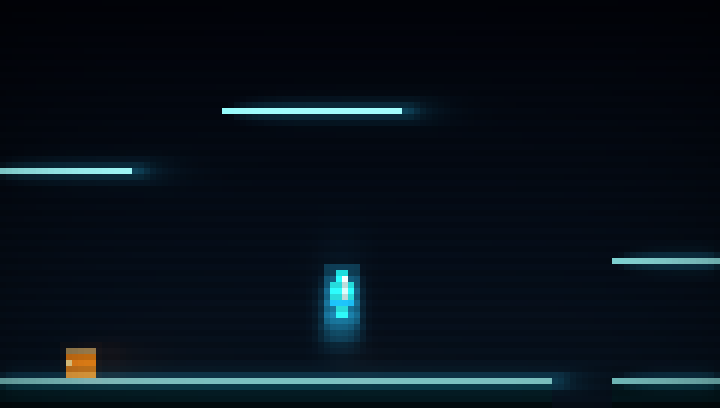

**movy** is a terminal-based graphics and animation engine that brings pixel-level rendering, visual effects, and interactivity to text mode.

## Overview

**movy** began with a simple vision - to bring real rendering power to the terminal - treating text mode as a programmable graphics environment rather than plain text output.

The engine provides:

* **Layered rendering** with alpha blending, z-ordering, and compositing.
* **Programmable pipelines** for chaining effects, transitions, and post-processing.
* **Frame-based rendering** - a float framebuffer with a persistent glow/bloom buffer and a built-in CRT post-fx stack (vignette, scanlines, flash, tint), giving a neon look essentially for free. Ideal for games and shader-toy-style demos.
* **Sprite and surface abstraction** for transparent drawing and dynamic frame animations.
* **Half-block rendering** for double vertical resolution.
* **Animation control** via IndexAnimators, waveform generators, and easing functions - driving frame indices, colors, positions, and other parameters.
* **High-throughput output** - `DiffOutput` re-paints only the terminal rows that changed, with an optional background writer thread, for smooth 60fps even under tmux / ssh.
* **Keyboard, mouse, and kitty-protocol input** - including true key press / repeat / release events on supporting terminals.

Rendering, animation, effects, and input are independent yet interoperable subsystems.

The result is a **modular visual engine** - expressive, composable, and built for creative experimentation.


(alien mouse move demo)


(dev snapshot of a game)



(frame-game - a neon platformer built on the new **Frame** rendering path - play it with `zig build run-frame-game`, read it in [demos/frame-game](./demos/frame-game/))


## Core Concepts

**movy** is organized around a few core types that coordinate how visuals are drawn, animated, and composed on screen.

For rendering specifically, movy offers **two paths**. They share the same `RenderSurface`, `Screen`, and terminal output, so you can mix them - but each is tuned for a different job:

| Path | Draw onto | Best for |
|------|-----------|----------|
| **Compositing Path** | `RenderSurface`s, layered through an effect pipeline | UI, sprite scenes, video playback, transitions, demos that combine many independent visual layers |
| **Frame Path** | a single `Frame` (float framebuffer + glow + CRT post-fx) | fast-moving games and shader-toy-style demos that want a neon look for free |

### Rendering Path 1 - Compositing

Layered surfaces, composited through a programmable effect pipeline.

- **RenderSurface** is the foundational structure - a 2D matrix of pixels (with optional text overlays) that anything visual draws onto. It supports alpha, can be resized, cleared, scaled, rotated, and converted to ANSI via `.toAnsi()`.

- **RenderEffect** modifies a RenderSurface by applying visual transformations such as blur, dim, stretch, or color shifting. It receives input and output surfaces via a `RenderEffectContext`, which handles size awareness and expansion when needed. Internally, `RenderEffect` acts as an interface and wraps an effect instance to make it compatible with chaining, pipelines, and dynamic surface management.  
  Each effect defines its own `run()` method and `validate()` method, and can optionally declare how much space it requires beyond the surface bounds. Effects can be run manually on surfaces, or exposed through a simple `asEffect()` function to integrate cleanly into the rendering system. They will automatically operate with `RenderEffectContext`, gaining full expansion handling and chaining capabilities.

- **RenderEffectContext** bundles an input surface, an output surface, and tracks any applied surface expansion. It allows effects and chains to dynamically resize their output to support visuals like glow or shake.

- **RenderEffectChain** is a reusable sequence of effects, applied in order to a `RenderEffectContext`. It takes care of intermediate surface allocation and ensures the final output is properly expanded. It's ideal for chaining multiple post-processing steps like fade -> blur -> glow.

- **RenderObject** combines a `RenderEffectContext` with an optional `RenderEffectChain`. It acts as a unit of rendering - providing a structured way to send a visual input surface through the effect system. The output surface is automatically created and kept in sync. (Conceptually, it's "a surface + maybe effects".)

- **RenderPipeline** processes a list of `RenderObject`s. Each object's effect chain (if present) is run, and their results are composited using the **RenderEngine**. Optionally, a final post-processing chain can be applied to the merged result.

- **RenderEngine** performs the actual surface merge. It composites multiple `RenderSurface`s into a single output, applying z-ordering and visibility logic. It supports multiple blending modes: binary transparency for performance-critical rendering, and full Porter-Duff alpha compositing for true semi-transparent effects. This is used by the pipeline, UI system, and manual rendering flows.

### Rendering Path 2 - Frame (neon-render layer)

A single float framebuffer with a built-in post-processing stack. Instead of compositing many surfaces, you draw straight into a **`Frame`**, which gives the neon look essentially for free. Great for games - see the [frame-game demo](./demos/frame-game/) for a complete, copy-able example.

- **Frame** is a float framebuffer built on top of a `RenderSurface`, with two layers and its own effect stack:
  - a **`solid`** layer for opaque colors (background, bodies, tiles) - you rewrite it each frame, and
  - a **`glow`** layer that is *additive and persistent*: every `beginFrame()` it is blurred and decayed, then the frame's emissions are added on top. A bright thing at a still spot becomes a stable **bloom**; if it moves, you get a neon **trail** - with zero per-object bookkeeping.
  
  `composite()` mixes the two and runs the post-fx chain - `clamp(solid + glow)` -> vignette -> scanline -> warmth -> flash -> tint - into the owned `RenderSurface` that `Screen` / `DiffOutput` consume. Drawing is simple: `px / rect / hline / vline / shadeRect` for solid, and `gpx / grect / ghline / gvline / gring` for glow. `savePng()` provides a headless screenshot dev loop (render N frames, save a PNG, look - no terminal needed).

- **color.V3** is the linear float color used while drawing (`V3{ r, g, b }`, 0..1, allowed to exceed 1.0 while light accumulates - that's what makes glow bloom). Helpers: `v3(r,g,b)`, `.add / .scale / .mul / .lerp`, `.toRgb()` / `.fromRgb()`. `composite()` clamps and quantizes to 8-bit for you.

### Output - shared by both paths

- **Screen** holds the final output surface. Manually, it allows you to add `RenderSurface`s or `Sprite`s directly and call `screen.render()` to composite them using the **RenderEngine**. Alternatively, its output surface can be rendered by the **RenderPipeline**, the **UI Manager**, or fed a `Frame`'s composited surface. Finally, `screen.output()` prints the result to the terminal using ANSI escape sequences.

- **DiffOutput** is a faster, drop-in replacement for `screen.output()`. It compares each terminal row against the previous frame and re-sends only the rows that changed (unchanged rows cost zero bytes), and in `.threaded` mode hands the blocking write to a background writer thread - so the render loop never stalls, dropping a frame instead of freezing. This is what keeps things smooth at 60fps, especially under tmux / ssh.

### Sprite Rendering

- Sprites hold a **SpriteFrameSet**: an array of frames, each with its own **RenderSurface**.
- Changing the current frame index animates the sprite.

### Animation Helpers

- **IndexAnimator** is a generic animation helper that updates indices over time. It supports forward, reverse, ping-pong, and one-shot modes, and can also be used for palette cycling, or any index based effects.
- **TrigWave** provides reusable sine and cosine generators with internal state. These simplify wave-based animations such as pulsing highlights, bobbing motion, or cyclic transitions.
- **Easing** - for easing curve based animations, functions for easing -in/-out/-inout are provided.

## movy_video

**movy_video** adds full-motion video playback to the terminal, built on FFmpeg and SDL2.

- **Video decoding** for all FFmpeg-supported formats (.mp4, .h264, .avi, .mkv, .webm, etc.)
- **Audio playback** with synchronized timing using SDL2
- **Frame scaling** and conversion to RGB for terminal rendering
- **Audio/video synchronization** with configurable sync windows
- **Seeking** with forward/backward navigation
- **Frame queueing** for smooth playback

The module exposes a `VideoDecoder` type that manages the entire decode pipeline, from opening media files to extracting frames and audio samples. Video frames are automatically scaled and rendered to **movy** `RenderSurface` objects, allowing seamless integration with the rest of the rendering engine.

See [movycat](https://github.com/M64GitHub/movycat) for a complete terminal video player built with **movy_video**.

### FFmpeg Compatibility

**movy_video** has been tested and confirmed working with:
- **FFmpeg 8.0** (macOS via Homebrew)
- **FFmpeg 7.1.1** (Ubuntu via apt)

The module uses the modern FFmpeg channel layout API (`AVChannelLayout`) and is compatible with both FFmpeg 7.x and 8.x versions.

## Building
Works with `zig 0.15.2`
```bash
zig build              # build without ffmpeg dependencies, movy_video
zig build -Dvideo=true # build full movy incl movy_video, requires ffmpeg
```

## Testing

Tests currently cover:

- RenderEngine: composition modes, alpha blending
- Sprite: splitting functions
- Indexanimator
- RenderSurface: scaling

```bash
zig build test
```

## Documentation

- **[Guides](./doc/README.md)** - Documentation on core concepts like RenderSurface and RenderEngine, written for developers new to movy
- **[Examples](./examples/)** - Code examples demonstrating specific features (alpha blending, PNG loading, sprite animations, rotation / scaling, ...)
- **[Demos](./demos/README.md)** - Programs showcasing visual effects, animations, and interaction
- **[Release Notes](./RELEASE_NOTES.md)** - What's new in the latest release (see [CHANGELOG.md](./CHANGELOG.md) for the full history)

The sections are being updated frequently.

> [!TIP]
> **Building a game? Start with [frame-game](./demos/frame-game/).**
> It's a complete, copy-able neon platformer that shows the new **Frame** rendering path end to end - persistent glow/bloom, linear float `V3` color, 60fps `DiffOutput`, and kitty-protocol input - alongside sub-pixel platformer physics, tile collision, and a follow camera with screen shake.
>
> ```sh
> zig build run-frame-game                         # play it
> zig build run-frame-game -- --shot 160 out.png   # headless: render 160 frames to a PNG
> ```
>
> Its [README](./demos/frame-game/README.md) is a full walkthrough of the Frame path.

## Showcase: Built with movy

| Project | Description | Preview |
|---------|-------------|---------|
| [1ST-SHOT](https://github.com/M64GitHub/1st-shot) | Terminal bullet-hell shooter with SID audio | |
| [movycat](https://github.com/M64GitHub/movycat) | Terminal video player | |
| *Your project here?* |  | Post in the [Community Showcase Discussion](https://github.com/M64GitHub/movy/discussions/10)! |

## Contributing

movy is a work of love and dedicated vision, still evolving rapidly.
External code contributions are paused for now, but ideas and feedback are always welcome -
see [CONTRIBUTING.md](./CONTRIBUTING.md) for details.

---

Made with `<3` and **Zig**

